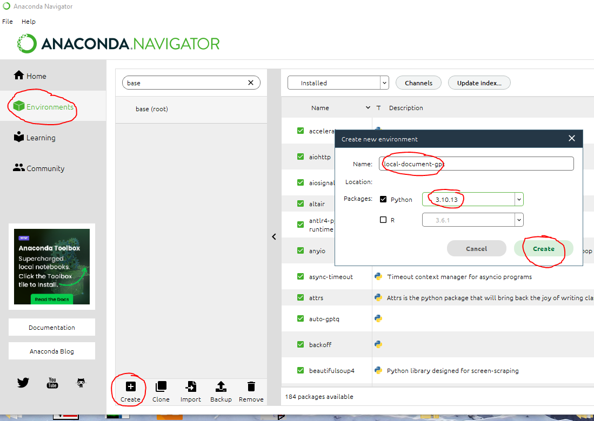
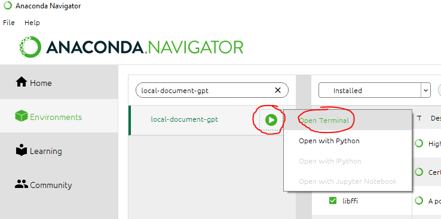
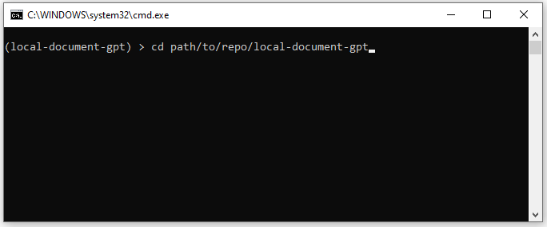

# Local Documents GPT


# Get started

## 1. Clone this repo
```shell
git clone https://github.com/Rufus31415/local-document-gpt.git
```

## 2. Install Anaconda
- Download : https://www.anaconda.com/download
- Create a new environment and activate it :

<details open>
<summary>Either from command line</summary>
  
```shell
conda create -n local-document-gpt python=3.10.13
conda activate local-document-gpt
```

</details>

<details>
<summary>Or from GUI</summary>
  






</details>

## 3. Install requirements
- Install Python requirements
```shell
pip install -r requirements.txt
```

## 4. (optional) Use CUDA
- Install CUDA if you have a compatible GPU : https://developer.nvidia.com/cuda-downloads
- Install Python requirements
```shell
pip install torch torchvision torchaudio --index-url https://download.pytorch.org/whl/cu121
```
- To check CUDA is available, this command shoud output ```True```
```shell
python -c "import torch;print(torch.cuda.is_available())"
```

## 5. Learn from your documents


## 6. Chat with your documents

